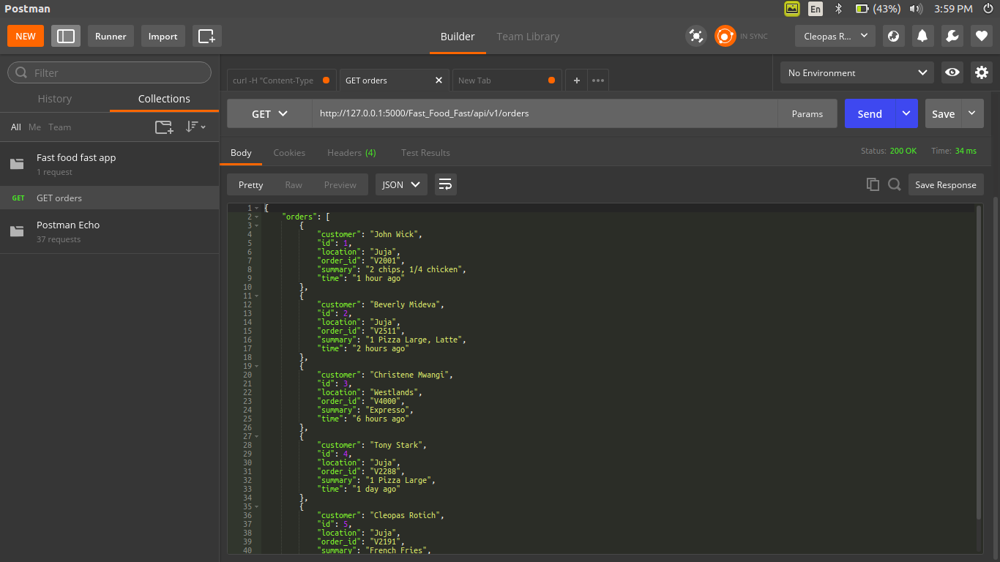
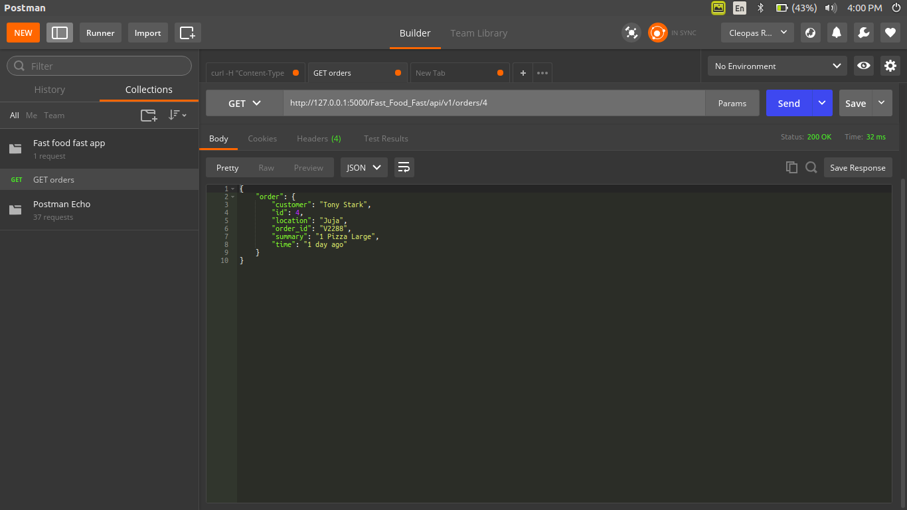

# Fast Food Fast APIs

Contains all APIs for the Fast food fast web application which is an online food application.

## Endpoints used

| Method  | Endpoint | Description |
| ------- | -------  | ----------- |
| POST    | '/fast_foods/api/v1/orders' | post all the orders |
| GET     | '/fast_foods/api/v1/orders' | recieve all orders |
| GET_one | '/fast_foods/api/v1/orders/<int:order_id>' | get only one order id |
| PUT     | '/fast_foods/api/v1/orders/<int:order_id>' | edit a specific order |
| DELETE  | '/fast_foods/api/v1/orders/<int:order_id>' | delete a specific order |

*you should have all the above endpoints working smoothly*

## Screenshots of the API test on Postman.

